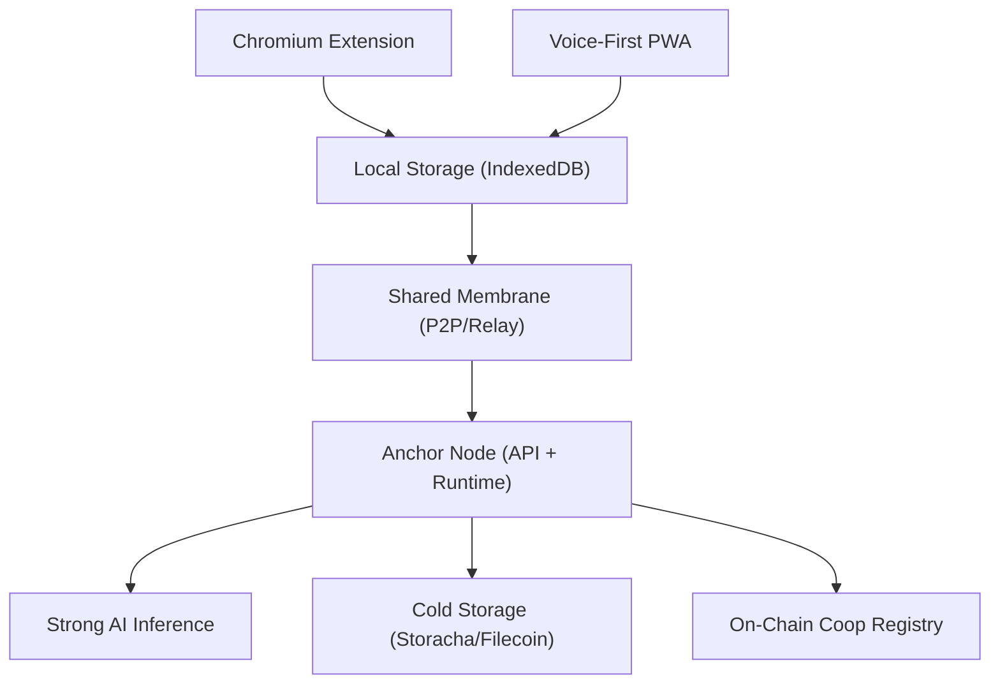

# Coop

Browser-based knowledge commons for local and bioregional coordination.

## What Coop Builds

Coop provides a browser-first coordination stack for communities:

- Chromium extension for capture and coop interaction
- Voice-first PWA for mobile input and participation
- Anchor node for AI processing, sync, and orchestration
- Shared package contracts for protocol and data consistency
- On-chain registry and smart-account-ready integration patterns

## Monorepo Packages

- `packages/extension`: Chromium extension (tab capture, voice dictation, Coop onboarding)
- `packages/pwa`: Mobile companion for voice-first participation
- `packages/anchor`: Anchor node API + agent runtime
- `packages/shared`: Shared types and storage protocol abstractions
- `packages/contracts`: Coop registry and account-abstraction integrations
- `packages/org-os`: Organizational OS schemas and templates imported for Coop setup

## Quick Start

If your local tree is out of sync with committed scaffold:

```bash
git restore .
```

Install and run workspace:

```bash
pnpm install
pnpm dev
```

Common workspace commands:

```bash
pnpm build
pnpm lint
pnpm check
pnpm format
```

Contracts package:

```bash
cd packages/contracts
forge build
forge test
```

## Architecture Overview



## Documentation

- [docs/architecture.md](docs/architecture.md) — Architecture overview
- [docs/onboarding-flow.md](docs/onboarding-flow.md) — Onboarding flow
- [docs/coop-component-plans.md](docs/coop-component-plans.md) — Component development plans (extension, anchor, PWA, shared, contracts, org-os, skills)
- [.cursor/plans/MASTERPLAN.md](.cursor/plans/MASTERPLAN.md) — Main execution roadmap for agents and subagents
- [.cursor/plans/01-extension.md](.cursor/plans/01-extension.md) through [.cursor/plans/08-cross-cutting.md](.cursor/plans/08-cross-cutting.md) — Component execution plans

## Core MVP Pillars

- Impact reporting
- Coordination
- Governance
- Capital formation

## Upstream Connections

- Standards and template source: [`organizational-os`](https://github.com/regen-coordination/organizational-os)
- Federation and coordination hub: [`regen-coordination-os`](https://github.com/regen-coordination/regen-coordination-os)
- Scope definition input: `260305 Luiz X Afo Coffee.md`
